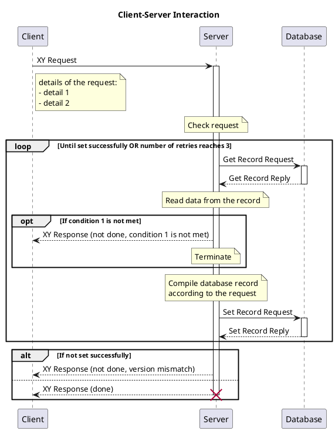
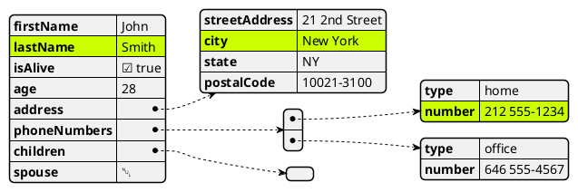
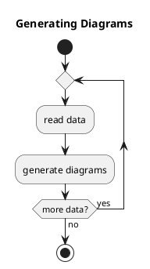
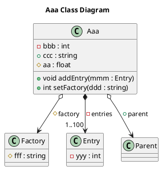
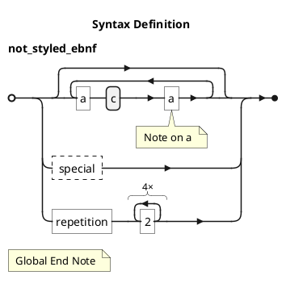
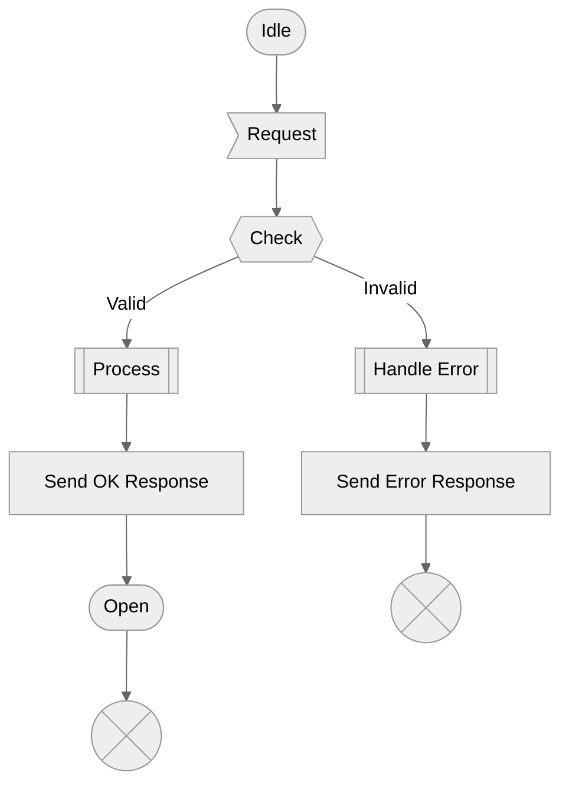
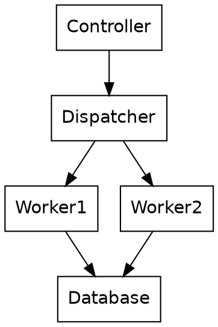

# Introduction

This document validates the `tdock` isolated technical documentation
build environment. It tests standard markdown rendering, syntax
highlighting for various languages, and the automatic vectorization of
diagrams.

For the capabilities of the underlying Markdown engine, see the official
**Pandoc:**
[The Universal Document Converter](https://pandoc.org/MANUAL.html)
documentation. [Pandoc Examples](https://pandoc.org/demos.html) is also
worth a check.


# Styling

We support standard styling:

- **Bold text** for emphasis.
- *Italic text* for terminology.
- ***Bold-Italic*** for critical notes.
- `Monospaced code` for inline commands.


# Tables

Tables are essential for documenting interface parameters or service
specifications.

| Interface | Protocol | Latency Target | Priority |
|:----------|:---------|:---------------|:---------|
| Gx        | Diameter | < 50ms         | High     |
| Ro        | Diameter | < 100ms        | Medium   |
| SIP       | UDP/TCP  | < 30ms         | High     |

: Service Interface Specifications 


# Mathematical Notation

For complex charging algorithms, we use standard LaTeX math support:

The transaction cost $C$ is calculated as:
$$C = \sum_{i=1}^{n} (t_i \times r_i) + \text{tax}$$


# Code-Blocks

By default, syntax highlighting uses the `tango` theme. The font should
map to the Google/Ubuntu fonts requested in the YAML frontmatter.


## C/C++

```c
#include <stdio.h>

typedef struct {
    int transaction_id;
    char status[16];
} Session;

int main() {
    Session s = {1042, "ACTIVE"};
    printf("Session %d is %s\n", s.transaction_id, s.status);
    return 0;
}
```


## Lua

```lua
function check_node(elem)
  if elem.t == "CodeBlock" then
    return pandoc.RawBlock("html", "<!-- Code Block Exists -->")
  end
end
```


## Bash

```bash
#!/bin/bash
echo "Starting compilation..."
mkdir -p build && cd build
cmake .. && make
```

## Python

```python
def fibonacci(n):
    if n <= 0:
        return []
    elif n == 1:
        return [0]
    elif n == 2:
        return [0, 1]
    else:
        seq = [0, 1]
        for i in range(2, n):
            seq.append(seq[-1] + seq[-2])
        return seq
```


# Automated Diagrams

The blocks below are automatically parsed by the Pandoc diagram Lua
filter, rendered via their respective engines, and embedded perfectly
into the PDF using XeLaTeX.

On GitHub, Mermaid code-blocks are automatically rendered, and plantUML
blocks can be visualized too with the
[PlantUML for GitHub Chrome Extension](https://github.com/plantuml/plantuml-for-github)


## PlantUML

- [Website](https://plantuml.com/)
- [Language Reference Guide](https://plantuml.com/en/guide)
- [Style Guide](https://plantuml.com/style-evolution)

This is an example reference to Figure \ref{fig:sde}.



---



---



---



---




## Mermaid

- [Mermaid Open-Source Intro](https://mermaid.ai/open-source/intro/)




## Graphviz/DOT

- [DOT Language Specification](https://graphviz.org/doc/info/lang.html)
- [Gallery](https://graphviz.org/gallery/)


