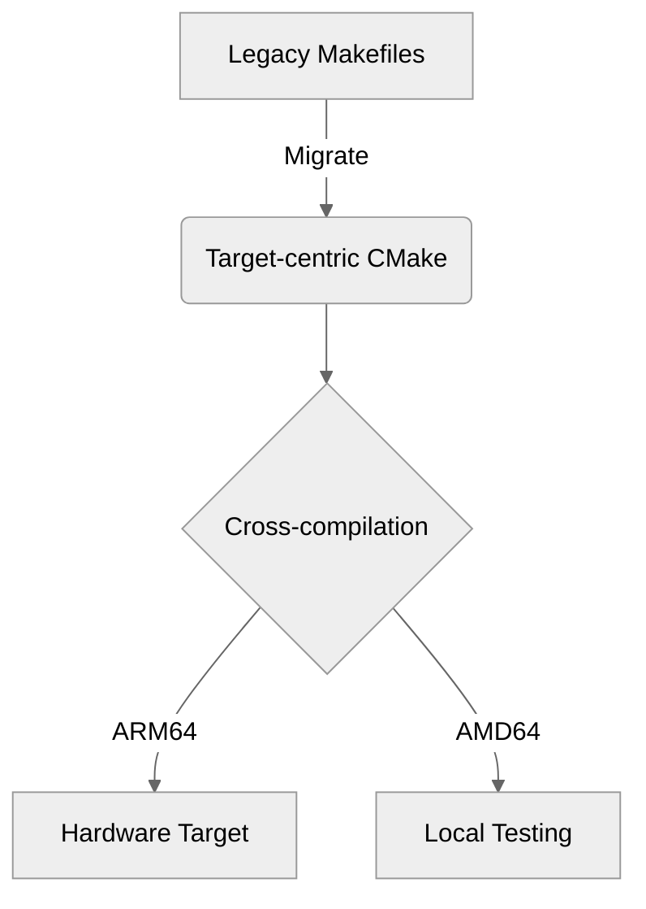

# Introduction

This document validates the `pandock` build environment. It tests
standard markdown rendering, syntax highlighting for various languages,
and the automatic vectorization of diagrams.

**Pandoc:** [The Universal Document Converter](https://pandoc.org/MANUAL.html)

Also check out the [Pandoc Examples](https://pandoc.org/demos.html) for advanced formatting.


# Styling

We support standard styling:

- **Bold text** for emphasis.
- *Italic text* for terminology.
- ***Bold-Italic*** for critical notes.
- `Monospaced code` for inline commands.


# Tables

Tables are essential for documenting interface parameters or service
specifications.

| Interface | Protocol | Latency Target | Priority |
|:----------|:---------|:---------------|:---------|
| Gx        | Diameter | < 50ms         | High     |
| Ro        | Diameter | < 100ms        | Medium   |
| SIP       | UDP/TCP  | < 30ms         | High     |

: Service Interface Specifications 


# Mathematical Notation

For complex charging algorithms, we use standard LaTeX math support:

The transaction cost $C$ is calculated as:
$$C = \sum_{i=1}^{n} (t_i \times r_i) + \text{tax}$$


# Code-Blocks

By default, syntax highlighting uses the `tango` theme. The font should
map to the Google/Ubuntu fonts requested in the YAML frontmatter.


## C/C++

```c
#include <stdio.h>

typedef struct {
    int transaction_id;
    char status[16];
} Session;

int main() {
    Session s = {1042, "ACTIVE"};
    printf("Session %d is %s\n", s.transaction_id, s.status);
    return 0;
}
```


## Lua

```lua
function check_node(elem)
  if elem.t == "CodeBlock" then
    return pandoc.RawBlock("html", "<!-- Code Block Exists -->")
  end
end
```


## Bash

```bash
#!/bin/bash
echo "Starting compilation..."
mkdir -p build && cd build
cmake .. && make
```

## Python

```python
def fibonacci(n):
    if n <= 0:
        return []
    elif n == 1:
        return [0]
    elif n == 2:
        return [0, 1]
    else:
        seq = [0, 1]
        for i in range(2, n):
            seq.append(seq[-1] + seq[-2])
        return seq
```


# Automated Diagrams

The blocks below are automatically parsed by the Pandoc diagram Lua
filter, rendered via their respective engines, and embedded perfectly
into the PDF using XeLaTeX.


## PlantUML

- [Website](https://plantuml.com/)
- [Language Reference Guide](https://plantuml.com/en/guide)
- [Style Guide](https://plantuml.com/style-evolution)

This is an example reference to Figure \ref{fig:sde}.

```plantuml {width=40% caption="PlantUML Sequence Diagram Example" placement="H" label="fig:sde"}
@startuml
!include style.puml
participant "Application Server" as AS
participant "Core Network" as Core

AS -> Core: INVITE sip:user@domain.com
Core --> AS: 100 Trying
Core --> AS: 200 OK
AS -> Core: ACK
@enduml
```


## Mermaid

- [Mermaid Open-Source Intro](https://mermaid.ai/open-source/intro/)




## Graphviz/DOT

- [DOT Language Specification](https://graphviz.org/doc/info/lang.html)
- [Gallery](https://graphviz.org/gallery/)


```dot {width=30% caption="Graphviz/DOT Diagram Example" placement="H"}
digraph G {
    node [shape=box, fontname="DejaVu Sans"];
    edge [fontname="DejaVu Sans"];

    Controller -> Dispatcher;
    Dispatcher -> Worker1;
    Dispatcher -> Worker2;
    Worker1 -> Database;
    Worker2 -> Database;
}
```
